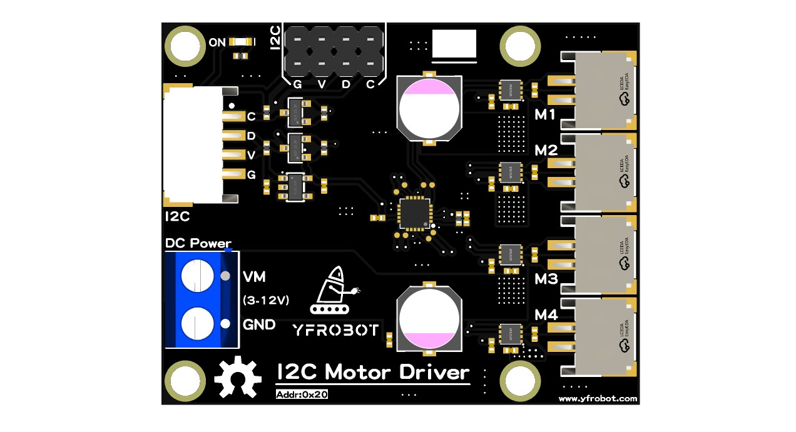

# Yfrobot-Motor-Driver-IIC1508-Library
YFROBOT IIC1508-4路电机驱动模块库 - YFROBOT Motor Driver IIC1508 Library for Arduino

通过IIC总线驱动4路直流电机，支持正反转、速度调节。

可用模块： IIC_MOTORDRIVER_IIC1508

## 相关链接 Links
* 产品购买链接: [YFROBOT网址](https://www.yfrobot.com/)、[YFROBOT淘宝商城](https://yfrobot.taobao.com/).
* [Motor Driver iic1508模块采购](https://yfrobot.taobao.com/search.htm?search=y&keyword=%B5%E7%BB%FA%C7%FD%B6%AF)、[Motor Driver iic1508模块简介](https://pjfcckenlt.feishu.cn/wiki/WonNwN3nNieS8pkQEPWcbn8DnYd)

## 库使用说明：
* 调用库：

`#include <MDIIC1508.h>   // 包含头文件`

* 创建对象：

`MDIIC1508 md_iic1508;`

Methods：

* 初始化，如果通讯成功，则返回1。

`md_iic1508.begin(MDIIC1508_ADDRESS)`

* 驱动单个或全部电机，参数：电机序号 1,2,3,4,5(全部电机)；电机速度 -255 ~ 255

`md_iic1508.setMotor(1, 255);  //M1 正转`

* 驱动4路电机，参数：电机速度 -255 ~ 255

`md_iic1508.setMotor(255, 255, 255, 255);  //正转`

`md_iic1508.setMotor(0, 0, 0, 0);  //停止`

* 电机停止

`md_iic1508.stopMotor(1);  //M1 停止`

`md_iic1508.stopMotor(5);  // 电机M1/M2/M3/M4 停止`

## 更新日志 Release Note

*  V0.0.5 修复反转程序错误。
*  V0.0.4 修复example名称。
*  V0.0.3 修复library.properties文件中的名称：Yfrobot Motor Driver IIC1508 Library。(无语)
*  V0.0.2 修复library.properties文件中的名称：MDIIC1508。
*  V0.0.1 IIC1508 4路电机驱动的基本使用，包含驱动单路电机，驱动全部电机，停止电机等功能。

## 联系我们 Contact Us
* http://www.yfrobot.com.cn/wiki/index.php?title=%E8%81%94%E7%B3%BB%E6%88%91%E4%BB%AC

## 其他扩展库 Other extension libraries
* https://www.arduinolibraries.info/authors/yfrobot-tm

## 参考 Reference Resources